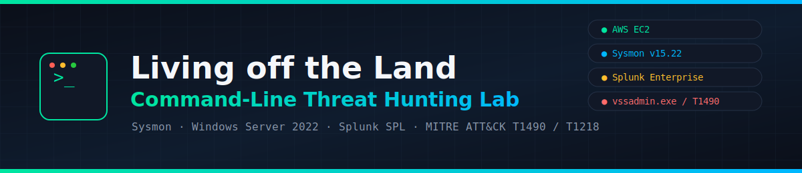
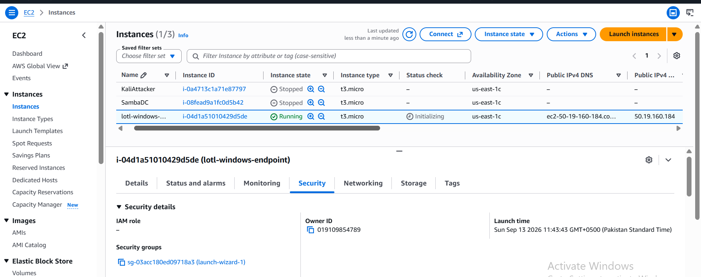
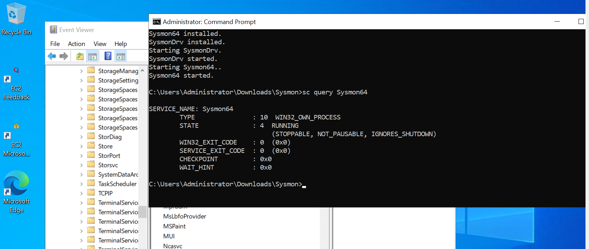
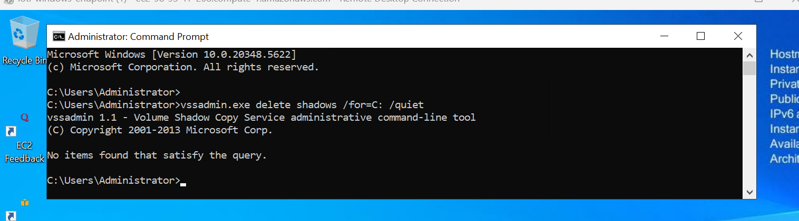
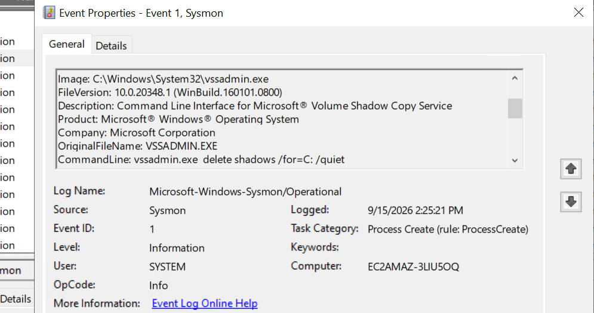
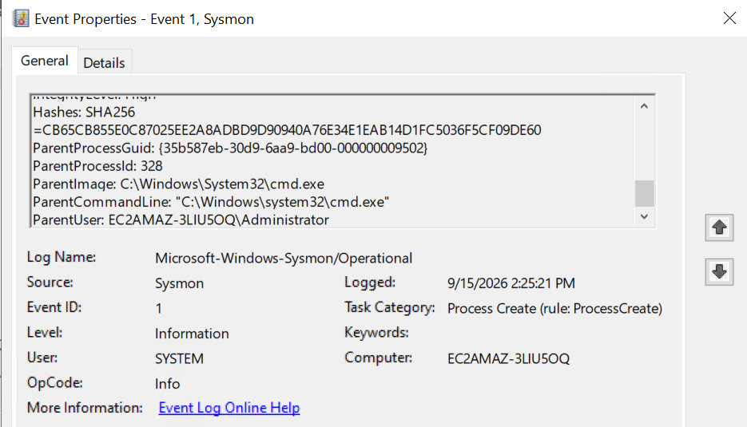
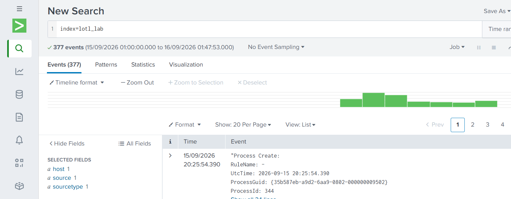
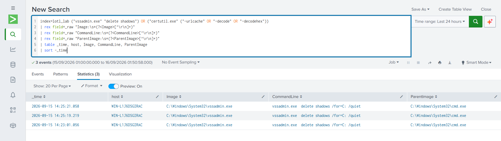
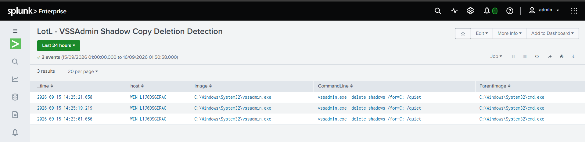

<p align="center">
  
</p>

<p align="center">
  
  
  
  
  
  
</p>

<h1 align="center">Living off the Land (LotL) Command-Line Hunting</h1>

<p align="center">
Detecting attackers who don't bring malware — they just use what's already on the box.
</p>

---

## 📖 Table of Contents

- [What is "Living off the Land"?](#-what-is-living-off-the-land)
- [Project Objective](#-project-objective)
- [Lab Architecture](#-lab-architecture)
- [Tools & Environment](#-tools--environment)
- [Walkthrough](#-walkthrough)
  - [1. Infrastructure Setup](#1-infrastructure-setup)
  - [2. Sysmon Deployment](#2-sysmon-deployment)
  - [3. Executing the Attack](#3-executing-the-attack)
  - [4. Capturing the Evidence](#4-capturing-the-evidence)
  - [5. Log Ingestion into Splunk](#5-log-ingestion-into-splunk)
  - [6. Building the Detection](#6-building-the-detection)
- [Key Finding: A Silent Logging Blackout](#-key-finding-a-silent-logging-blackout)
- [MITRE ATT&CK Mapping](#-mitre-attck-mapping)
- [Repository Structure](#-repository-structure)
- [Skills Demonstrated](#-skills-demonstrated)
- [Author](#-author)

---

## 🧠 What is "Living off the Land"?

Imagine a burglar breaks into a house — but instead of bringing a
crowbar or lockpicks, they just use the **kitchen knife already in
the drawer** and the **spare key hidden under the mat**. Nothing they
used was suspicious to own. It was already there, meant for a totally
innocent purpose. That's what makes it so hard to catch.

**"Living off the Land" (LotL)** is the cyberattack version of that
idea. Instead of dropping custom malware (which antivirus can often
recognize), attackers use **legitimate tools that are already built
into Windows** — things IT admins use every single day — to carry out
malicious actions:

| Native Windows tool | Legitimate use | How attackers abuse it |
|---|---|---|
| `vssadmin.exe` | Manage backup snapshots (shadow copies) | Delete all backups right before deploying ransomware, so the victim can't recover files |
| `certutil.exe` | Manage security certificates | Silently download malware from the internet or decode a hidden payload |
| `powershell.exe` | Automate admin tasks | Run malicious scripts entirely in memory, leaving fewer traces on disk |

Because these binaries are digitally signed by Microsoft and used
constantly for normal IT work, traditional antivirus tools usually
**don't flag them** — the "malware" is just a command line. This is
exactly why security teams rely on **behavioral detection**: watching
not just *what* ran, but the full context — *what process launched it,
what arguments were passed, and what it did next.*

This project builds that detection capability from the ground up:
generate the attack, capture it at the process level with Sysmon, and
write a query that would catch it in a real SOC environment.

---

## 🎯 Project Objective

1. Stand up a Windows endpoint and install **Sysmon** for deep
   process-level visibility.
2. Simulate a real LotL technique used by ransomware operators:
   deleting Volume Shadow Copies via `vssadmin.exe` to block recovery.
3. Capture the resulting **Sysmon Event ID 1 (Process Create)** log,
   proving the `Image`, `CommandLine`, and `ParentImage` fields needed
   for detection.
4. Ingest that evidence into **Splunk** and build a working **SPL
   detection query** that flags this exact behavior pattern.

---

## 🏗️ Lab Architecture

```
┌─────────────────────────────┐
│   AWS EC2 (us-east-1)       │
│   Windows Server 2022       │
│   ┌────────────────────┐    │
│   │  Sysmon v15.22      │   │      1. Attacker runs
│   │  (Process telemetry)│◄──┼──────   vssadmin.exe delete shadows
│   └─────────┬────────────┘  │
│             │ Event ID 1     │
│             ▼                │
│   Microsoft-Windows-Sysmon/  │
│   Operational.evtx           │
└─────────────┬─────────────────┘
              │ 2. Export & transfer
              ▼
┌─────────────────────────────┐
│   Splunk Enterprise          │
│   index=lotl_lab             │
│                               │
│   3. SPL detection query     │
│      flags vssadmin/certutil │
│      shadow-copy deletion    │
└─────────────────────────────┘
```

---

## 🛠️ Tools & Environment

| Component | Detail |
|---|---|
| Cloud provider | AWS EC2 (`us-east-1`) |
| Endpoint OS | Microsoft Windows Server 2022 Base |
| Instance type | `t3.small` |
| Telemetry | Sysmon v15.22 (Sysinternals) |
| Attack technique | `vssadmin.exe delete shadows /for=C: /quiet` |
| SIEM | Splunk Enterprise (Free license) |
| Query language | Splunk SPL |
| Access method | RDP + AWS Systems Manager Session Manager (backup access) |

---

## 🚶 Walkthrough

### 1. Infrastructure Setup

A Windows Server 2022 instance was launched in AWS EC2 to serve as the
victim endpoint.

<p align="center"></p>

### 2. Sysmon Deployment

Sysmon was installed and confirmed running as a Windows service,
providing the process-creation telemetry this project depends on.

<p align="center"></p>

### 3. Executing the Attack

The LotL technique was executed directly on the endpoint — the same
command ransomware operators run to wipe out shadow-copy backups
before encrypting a victim's files:

```cmd
vssadmin.exe delete shadows /for=C: /quiet
```

<p align="center"></p>

### 4. Capturing the Evidence

The resulting **Sysmon Event ID 1 (Process Create)** was located in
Event Viewer, confirming the full process lineage:

- **Image:** `C:\Windows\System32\vssadmin.exe`
- **CommandLine:** `vssadmin.exe delete shadows /for=C: /quiet`
- **ParentImage:** `C:\Windows\System32\cmd.exe`

<p align="center">
  <br>
  
</p>

### 5. Log Ingestion into Splunk

The Sysmon Operational log was exported and ingested into Splunk
under a dedicated index (`lotl_lab`) for analysis.

<p align="center"></p>

### 6. Building the Detection

A Splunk SPL query (see [`detection/splunk_detection.spl`](detection/splunk_detection.spl))
was written and validated against the ingested evidence, cleanly
extracting `Image`, `CommandLine`, and `ParentImage` for every match:

<p align="center"></p>

The query was saved as a reusable Splunk report for future hunts:

<p align="center"></p>

---

## 🔎 Key Finding: A Silent Logging Blackout

Midway through the project, Sysmon stopped logging **any** Process
Create events — despite the service and its ETW trace session both
reporting healthy. The cause was a misconfigured `sysmonconfig.xml`:

```xml
<ProcessCreate onmatch="include"/>   <!-- empty include list = log NOTHING -->
```

Changing this to `onmatch="exclude"` (with an empty exclude list)
restored full logging by telling Sysmon to log *everything* instead
of only a (non-existent) allow-list.

This is a great example of why detection engineers should validate
new configs with a **known-good test event**, not just a service
status check — a green service can still mean zero visibility.
Full write-up: [`detection/sysmon_config_notes.md`](detection/sysmon_config_notes.md).

---

## 🗺️ MITRE ATT&CK Mapping

| Technique | ID | How it applies here |
|---|---|---|
| Inhibit System Recovery | [T1490](https://attack.mitre.org/techniques/T1490/) | `vssadmin.exe delete shadows` removes Volume Shadow Copy backups, a common pre-ransomware step |
| System Binary Proxy Execution | [T1218](https://attack.mitre.org/techniques/T1218/) | `certutil.exe` abused to download or decode payloads using a trusted, signed binary |

---

## 📂 Repository Structure

```
.
├── README.md
├── banner.png / banner.svg
├── screenshots/
│   ├── 01-ec2-instance-launched.png
│   ├── 02-sysmon-installed-running.png
│   ├── 03-lotl-attack-execution.png
│   ├── 04-sysmon-detection-image-commandline.png
│   ├── 05-sysmon-detection-parentimage.png
│   ├── 06-splunk-log-ingestion.png
│   ├── 07-splunk-detection-query-results.png
│   └── 08-splunk-saved-detection-report.png
└── detection/
    ├── splunk_detection.spl
    └── sysmon_config_notes.md
```

---

## 💡 Skills Demonstrated

- Cloud infrastructure provisioning (AWS EC2, security groups, IAM roles)
- Endpoint telemetry engineering with Sysmon
- Adversary technique simulation (LotL / native binary abuse)
- Windows event log analysis (Event Viewer, Sysmon Operational log)
- Log ingestion and index management in Splunk
- Detection engineering with Splunk SPL
- Root-cause troubleshooting of a telemetry pipeline failure
- MITRE ATT&CK technique mapping

---

## 👤 Author

Built as a hands-on detection engineering exercise — from spinning up
infrastructure to shipping a validated SPL detection rule, end to end.

